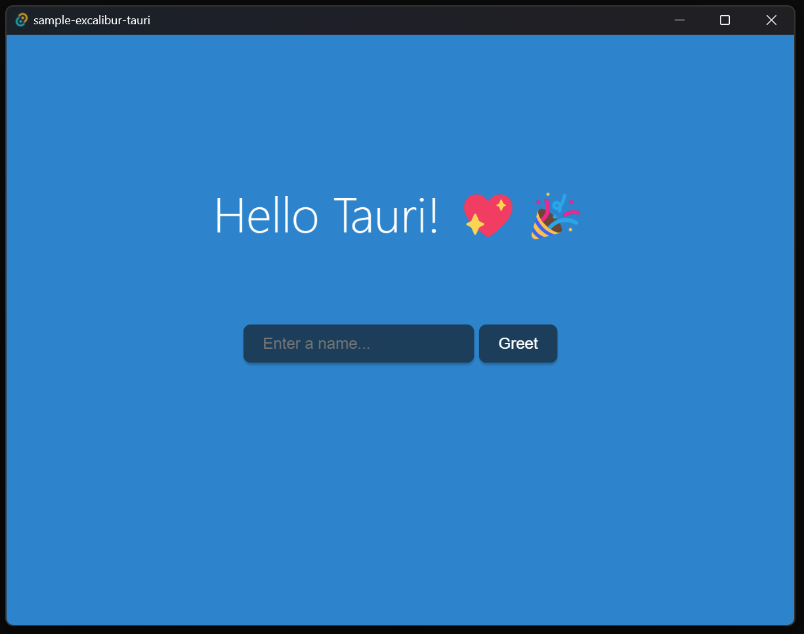

# Tauri + Excalibur

This template should help get you started developing with Tauri in vanilla HTML, CSS and Typescript.

## Running Locally

Install Rust
* https://www.rust-lang.org/learn/get-started#installing-rust

Install Node
* https://nodejs.org/en/download

Run
* `npm install`
* `npm run tauri:dev`

## Recommended IDE Setup

- [VS Code](https://code.visualstudio.com/) + [Tauri](https://marketplace.visualstudio.com/items?itemName=tauri-apps.tauri-vscode) + [rust-analyzer](https://marketplace.visualstudio.com/items?itemName=rust-lang.rust-analyzer)
